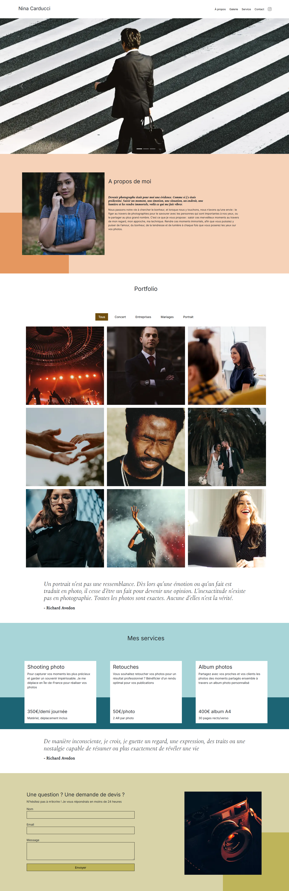
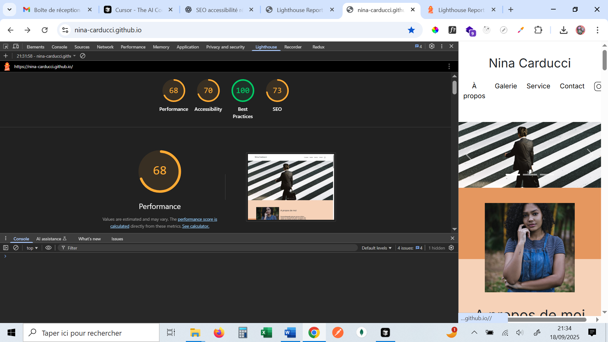
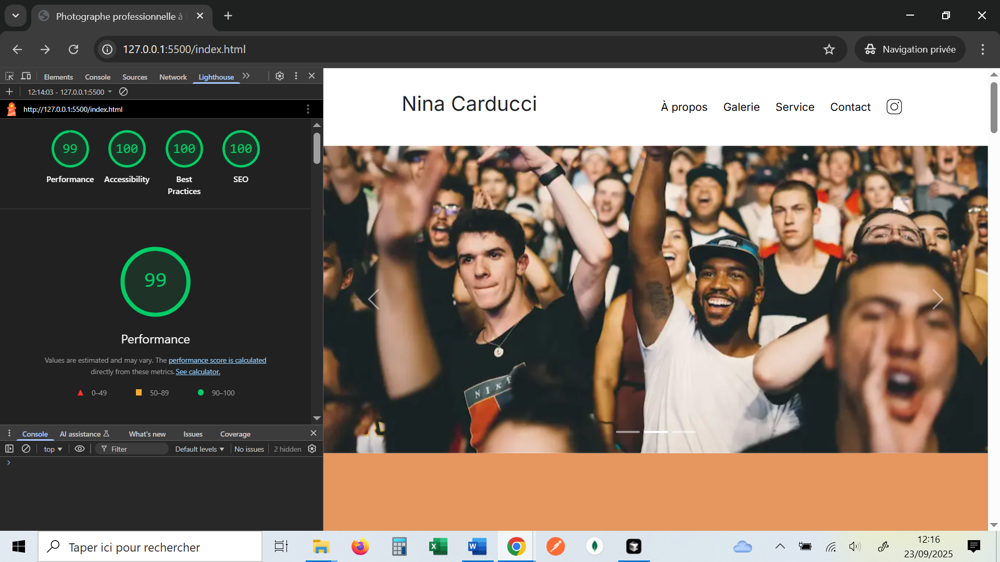

# Projet 4 — Nina Carducci (OpenClassrooms)

Optimisation complète d’un site vitrine existant pour une photographe :  
corrections de bugs, amélioration des performances (98% de réduction du poids des images),  
accessibilité renforcée et SEO optimisé.

---

## Sommaire

- [Démo / Déploiement](#démo--déploiement)
- [Captures d’écran](#captures-décran)
- [Objectifs pédagogiques](#objectifs-pédagogiques)
- [Améliorations apportées](#améliorations-apportées)
- [Résultats LightHouse avant / après](#résultats-avant--après)
- [Lancer le projet en local](#lancer-le-projet-en-local)
- [Outils et versions clés](#outils-et-versions-clés)
- [Ce que j’ai appris](#ce-que-jai-appris)
- [Crédits](#crédits)

---

## Démo / Déploiement

- **Lien de production**: [https://ninacarducci-photographe-bordeaux.netlify.app](https://ninacarducci-photographe-bordeaux.netlify.app)  
  (déployé avec Netlify)

---

## Captures d’écran

### Aperçu du site (Desktop)

### Rapports Lighthouse (desktop)

- **Avant optimisations**
  

- **Après optimisations**
  

---

## Objectifs pédagogiques

- Débugger un site web grâce aux Chrome DevTools
- Optimiser les performances du site (chargement, rendu, assets)
- Renforcer l’accessibilité (WCAG) et le SEO
- Rédiger un cahier de recette pour tester le site

---

## Améliorations apportées

### Performance

- **Images optimisées** : conversion en WebP, déclinaisons responsives (420/600/900/1400)
- **Gain de poids** : 29,4 MB → 456,09 kB (**98,5% de réduction**)
- **Ressources minifiées** : `bootstrap.min.css`, `bootstrap.bundle.min.js`, `style.min.css`
- **Rendu initial amélioré** : ajustement de l'ordre de chargement des scripts/styles
- **Mise en cache des assets** : cache 1 an via Netlify (netlify.toml) pour réduire les requêtes serveur

### Accessibilité

- **Attributs `alt` significatifs** sur toutes les images
- **Hiérarchie des titres** revue pour plus de sémantique
- **Formulaire** : ajout des attributs `autocomplete` et `for`
- **Contrastes** vérifiés et corrigés

### SEO

- **Balises meta** (title, description) uniques et pertinentes
- **Structure sémantique** clarifiée (header, main, footer, hn)
- **Attributs manquants** (`lang`, `doctype`) ajoutés
- **Microdonnées** (Schema.org) pour le référencement local
- **Balises Open Graph & Twitter Cards** pour le partage sur réseaux sociaux
- **Validation** via Schema.org validator et Google Rich Snippets

### Qualité / JS & CSS

- **Scripts** : ordre de chargement optimisé (non bloquants)
- **jQuery** : mise à jour → 3.6.4, hébergement local
- **Preconnect & Preload** ajoutés pour les polices et ressources critiques
- **Corrections de bugs** signalés par la cliente

---

## Résultats LightHouse (desktop) avant / après

| Critère       | Avant | Après |
| ------------- | ----- | ----- |
| Performance   | 68    | 98    |
| Accessibilité | 70    | 100   |
| SEO           | 73    | 100   |

---

## Lancer le projet en local

1. Cloner ce dépôt
2. Ouvrir `index.html` dans un navigateur
   - Recommandé : extension type « Live Server » pour auto-reload
3. Aucun build nécessaire (projet statique HTML/CSS/JS)

---

## Outils et versions clés

- HTML5 / CSS3 / JavaScript (ES6+)
- Bootstrap (inclus dans `assets/bootstrap`)
- jQuery 3.6.4 (`assets/jquery-3.6.4.min.js`)

---

## Ce que j’ai appris

- Utiliser Lighthouse et les DevTools pour identifier les problèmes de performance
- Optimiser des images et réduire drastiquement leur poids sans perte visible
- Structurer un site avec des balises sémantiques adaptées pour SEO et accessibilité
- Déboguer et fiabiliser un projet client existant

---

## Crédits

- Photos : auteurs crédités dans les fichiers d’images (Unsplash, etc.)
- Projet pédagogique : OpenClassrooms — Parcours Développeur Web (Projet 4)
